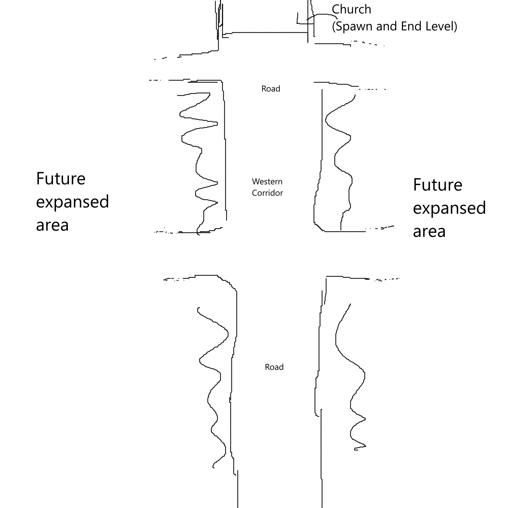
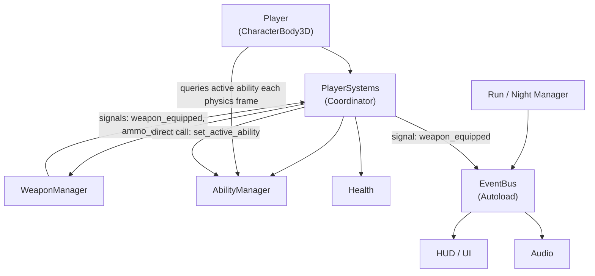
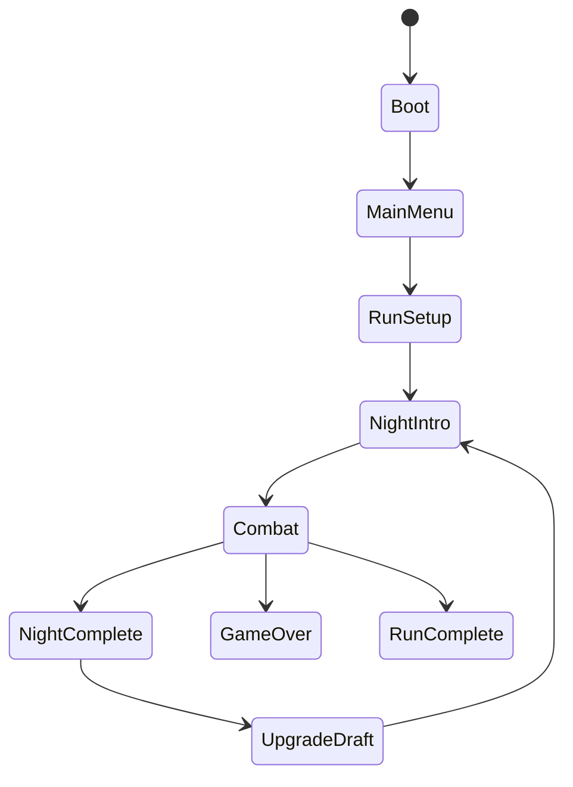
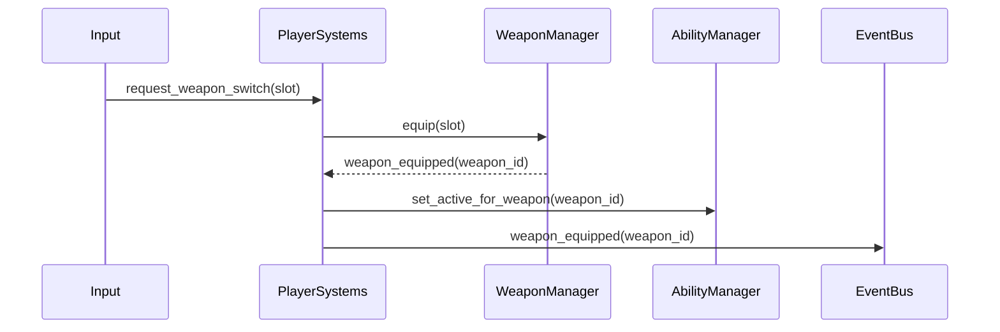
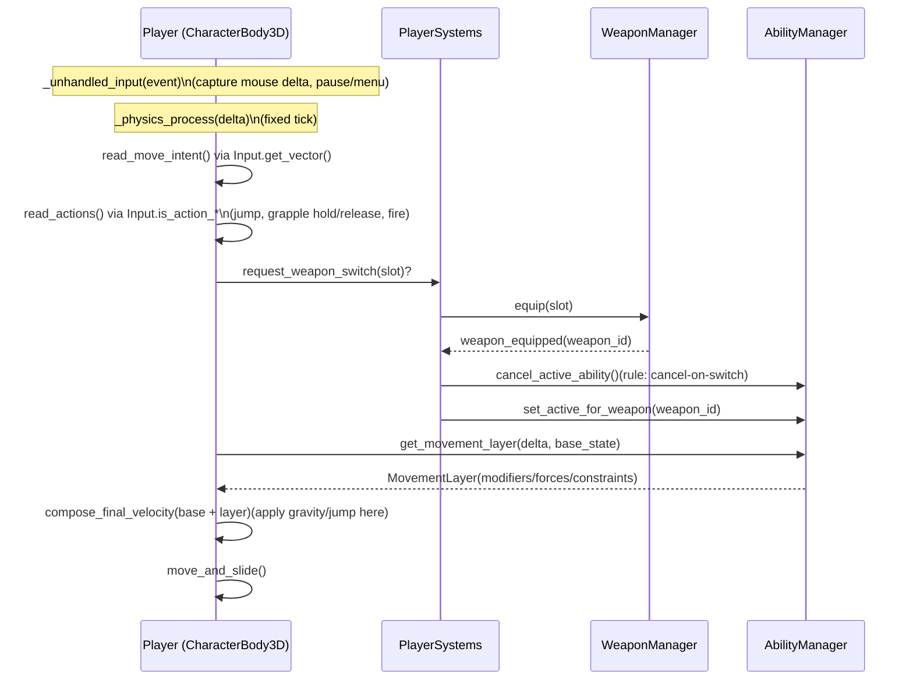
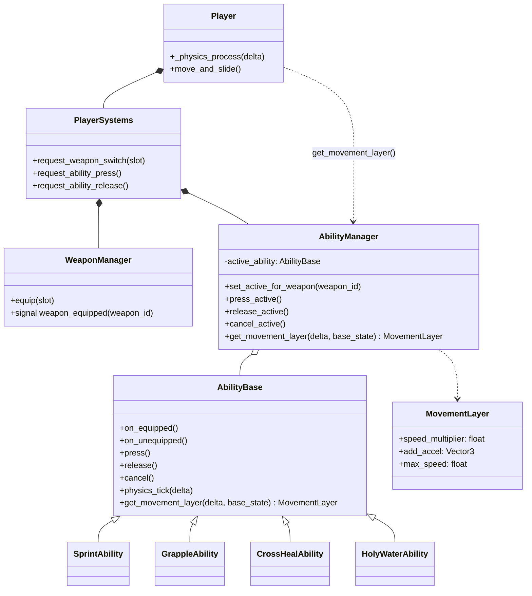

# GDD

## Overview

### Vision Statement
>
> In Ultra West, a forsaken frontier overrun by demonic hordes, survival means gunslinging through relentless nightmares.

Ultra West is a fast-paced 2.5D FPS where mobility, precision, and creativity define your fight against the apocalypse. Players wield an arsenal of distinctive weapons, each with unique abilities and playstyles, forming a deadly puzzle for surviving relentless waves of foes.
With dynamic combat that demands constant weapon switching and quick reflexes, Ultra West rewards mastery and adaptability. Dive into a chaotic, adrenaline-fueled battle where every second counts, and only the sharpest gunslinger can conquer the night ’til dawn.

### Genre

Primary: Action 2.5D First-person shooter
Extended: A stylized 2.5D comic book old-school FPS with fast and fluid movement, unique weapons, and fast-paced, run-based action.

### Target Audience

Hardcore FPS players who enjoy high-speed, skill-based combat. Ideal for fans of DOOM, ULTRAKILL, and fast rogue-lite games.

### Inspiration

Games like DOOM 2016, ULTRAKILL, and fast-paced games that reward investing in learning the mechanics. The gun mechanics from DOOM Eternal, where constant switching is a must to utilize the different weapons’ skills and strengths.

## Core Gameplay

The main mechanics of Ultra West are tailored to give the player a high-octane old-school FPS experience. The game is focused on being a simple but engaging experience, with mechanics centered more on motor skill and micro play rather than long, planned macro play. (TO-DO bigger introduction)

### Player Objectives

The player objectives in Ultra West are simple and focused on short-term gameplay. (TO-DO bigger introduction)
**Short-term:**

- Kill enemies
- Survive each night
- Acquire run upgrades

**Long-Term:**

- Finish an entire run
- Get a better high score (TO-DO types of scoring)
- Improve the player skill with the mechanics
- Acquire game upgrades and unlocks

### Core Mechanics

Ultra West focuses on fast movement and gunplay; the core mechanics are built around those ideas. (TO-DO bigger introduction)

### Movement Mechanics

Movement is tied to each gun in the game, making the gun and gun-switching mechanic more intricate.

- Sprint (Revolver): Always-on speed modifier while the Revolver is equipped.
- Grappling Hook (Shotgun): Fast projectile hook that can attach to world geometry or enemies.
  - Player pull: “Pull-to-point” (winch/reel-in) as the primary behavior, while still allowing player steering for responsive swinging.
  - Gravity remains active (grapple is stronger than gravity; no full floaty suspension by default).
  - Release-to-cancel (player controls when to stop grappling).
  - Enemy pull: Behavior depends on enemy type (e.g., light enemies get pulled to the player; heavies may pull the player more; some may resist/ignore).
- Air Burst / Air Dash: Grenade Launcher enables an air movement that pushes the player opposite the direction they’re looking.
- Slow-Time / Focus: The Crossbow enables the player to slow time.
- Basic evergreen movement: Movements that are usually in fast paced FPS.

### Gun Mechanics

- Revolver: Powerful single hitscan shot; slower cadence.
- Shotgun: Spread shot, 2 shells. If the grappling hook targets an enemy, it stuns and pulls them toward the player.
- Grenade Launcher: Powerful single explosion, area damage. Can knock the player for movement.
- Crossbow: A sniper with a single powerful shot without falloff damage; only weapon with aim down sights.
- Cross and Holy Water: Holy Water creates an area that damages and debuffs enemies. Cross heals the player passively.

### Gun Switching Mechanic

Constant gun switching is a core mechanic. Each gun is unique in shooting, ability, and effectiveness against specific enemies. Guns automatically reload when holstered. As movement is tied to the guns, this incentivizes constant switching.

Design + implementation intent (high-level):

- Switching a weapon also switches the active movement ability (Revolver→Sprint, Shotgun→Grapple, etc.).
- Abilities are implemented as movement layers: most are modifiers (e.g., Sprint), while some act as temporary movement “overrides” by injecting pull/constraints (e.g., Grapple) without duplicating the entire base movement controller.

### Roguelite Mechanics

Ultra West focuses on roguelite mechanics for replayability and longevity.

- Start every run with the basic setup.
- Unlock run upgrades at the end of each night.
- Unlock rewards and meta-upgrades at the end of each run.

#### Upgrade System: The Dealer's Hand

The upgrade system is thematically framed as a game of poker with a mysterious entity known as **The Dealer**. Between nights, the player visits a safe zone (Saloon/Church) to draft upgrades presented as **Cards**.

**Core Philosophy:**
Upgrades must reinforce the loop  of switching weapons and moving, not replace it. We avoid passive stat sticks that encourage sticking to one weapon.

**Categories:**

1. **Iron (Weapon Mods):** Enhancements for specific guns.
    - *Examples:* Ricochet Rounds (Revolver), Dragon's Breath (Shotgun), Cluster Bomb (Grenade Launcher).
2. **Blood (Stats & Survival):** Buffs to player survivability and movement resource efficiency.
    - *Examples:* Adrenaline (Speed on kill), Thick Skin (+Max HP), Elasticity (+Grapple range).
3. **Flow (Synergies):** The most critical category. These trigger on **Weapon Switching** or **Movement Abilities**.
    - *Examples:*
        - *Quickdraw:* +Damage on first shot after swap.
        - *Auto-Loader:* Holstered weapons reload faster.
        - *Momentum:* Using a movement ability instantly reloads the *other* weapons.

**Acquisition Loop:**

1. **End of Night:** The Dealer presents 3 Cards.
2. **Selection:** Player picks 1.
3. **Reroll:** Player can spend currency (Souls/Gold) to reroll the hand.
4. **Rarity:**
    - **Common (White):** Standard buffs.
    - **Rare (Gold):** Game-changing effects.
    - **Cursed (Red):** Massive power with a significant downside (High Risk/Reward).

### Gameplay Loop

(TO-DO: Improve the retention part of the gameplay loop)
Ultra West focuses on an action skill-based loop with breathing mechanics to provide rhythm. The goal is a strong flow state during action (micro loop) and clear engage/disengage moments (macro loop).
Long Loop: **Start Game** ➝ **Play Multiple Nights (Short Loop)** ➝ **Die or Win** ➝ **Cooldown / Reflect** ➝ **Unlock/Buy Upgrades** ➝ **Repeat Run**
Short Loop: **Enter Arena** ➝ **Mobility & Targeting** (sprint, aim, dodge) ➝ **Shoot / Switch Weapons** ➝ **Combo / Survive Waves** ➝ **Clear Night**
**Gameplay loop:**

[TODO Insert Gameplay Loop Image]

### Win / Loss Conditions

The game has a simple structure of play, so the win and loss conditions are also simple:
**Win Condition:**

- Survive the night (micro)
- Survive all nights and finish the game (macro)

**Loss Condition:**

- Health reaches 0

## Enemy Design

**Design Philosophy:**
Enemies in Ultra West are designed as "Combat Puzzles." Each enemy type encourages or discourages specific movements and weapon choices, forcing the player to constantly adapt their strategy to maintain the "Flow State."

**Core Enemy Roles:**

- **Chasers:** Melee units that rush the player, forcing kiting and area damage.
- **Shooters:** Ranged units that use cover or distance, forcing the player to close the gap (Grapple) or snipe.
- **Area Deniers:** Units that create hazard zones, forcing air mobility.
- **Heavies:** High-threat targets requiring high DPS and specific counters.

## World and Story

(TO-DO introduction)

### Setting and Theme

The **Wounded West** is a lawless, haunted and cursed frontier where reality itself is unraveling. A land of **ghost towns, abandoned mines, and shifting nightmares**, it was once home to ambitious settlers before the arrival of **something unspeakable**. Now, only the damned remain.
With a **dark Western aesthetic mixed with supernatural horror**, the world is filled with decayed towns, eerie deserts, and blood-red skies. The soundtrack fuses **spaghetti western vibes and heavy metal with unsettling synths and distorted guitars**, intensifying the relentless pace of the game.

### Story Overview

You are **The Hunter** (working title), a lone gunslinger and bounty hunter in the **Wounded West**, where the nights are long and dangerous.
When the WOUND happened, you were one of the few who could go against the hordes at night and push back the horrors. Now, people in small towns need demon hunters like you to protect them at night.

### Narrative Structure

The story unfolds in a **roguelike format**, where each run brings **fragments of lore** through:

- **Environmental storytelling:** Ruined buildings, cryptic messages, and statues depicting past events.
- **NPCs:** Mysterious figures who reveal pieces of the truth.
- **Item Descriptions:** Weapons and artifacts with hidden histories.
- **Endings:** Multiple endings based on progression and hidden choices.

### Factions, Enemies, and Characters

**Factions:**

1. **The Hollowed:**
   - *Lore:* The remnants of the townsfolk, stripped of humanity by the Wound. Mindless husks that swarm the living.
2. **The Lawless:**
   - *Lore:* Undead gunslingers, bandits, and corrupt lawmen who retained their combat skills but lost their souls. They organize and hunt with twisted intelligence.
3. **The Hellborn:**
   - *Lore:* Manifestations of the Wound itself. Grotesque demons that defy natural laws, born from the nightmares of the frontier.

**Characters:**

- **The Hunter:** (Player) A mute vessel of vengeance.
- **The Dealer:** The mysterious entity offering power for a price between nights.

## Level Design

Ultra West has an arena-style level design, built around fast gameplay, movement, and gun mechanics. Initially, the game will have a single arena (more will be designed in the future).

### Initial Level Concept

Level/City 1 (TO-DO update level design)


###

Ultra West is structured in arenas where the player fights, each with different flow and enemies, set in decaying frontier towns across the Wounded West. Each arena should highlight different weapons and tell part of the world’s story.
The flow of the levels are going to be structured in the classic arena shooter gameplay. The player is going to start in the safe zone(church) where is going to serve as the resting point of the game and upgrades. The outside is where the combat and action takes place, this is where the player is going to be challenged. After the action, the player goes back to the safe zone.

ARENAS:

- **Arena 1 (The Outskirts):** The initial arena will be relatively flat with clear sightlines to facilitate learning the movement and enemy behavior.
- **Future Arenas:** Subsequent arenas will introduce verticality and environmental hazards to challenge specific movement mechanics (e.g., vertical shafts for Grappling, wide gaps for Air Burst).

## Art and Aesthetics

**Visual Style: "High-Fidelity Retro Noir"**
Ultra West combines low-poly 3D environments and pixel-art 2D sprite characters (billboards) with modern rendering techniques to create a unique, atmospheric look.

- **Palette:** High contrast. Dominant colors are Rust Orange (Desert), Deep Red (Blood/Sky), and Void Black (Shadows/Demons).
- **Lighting:** A core pillar of the aesthetic. We use modern, dynamic lighting (real-time shadows, volumetric fog, emission) to ground the 2D sprites in the 3D world. Muzzle flashes should light up the environment, and enemies should cast long, dramatic shadows.
- **VFX:** A blend of retro and modern. We use high-fidelity GPU particle systems for blood, explosions, and magic, but styled to fit the pixel-art aesthetic. No "comic book text" effects; the impact comes from visceral lighting and physics.
- **Readability:** Enemies must have distinct silhouettes and color-coded weak points to ensure instant recognition in fast combat.

## Audio Design

**Music: "Industrial Spaghetti Western"**
The soundtrack reflects the clash between the Old West and the Demonic Invasion.

- **Instrumentation:** Distorted slide guitars, heavy industrial percussion, church bells, and synthesized choirs.
- **Dynamic Mixing:** The music intensifies with the "Style Meter" or combat intensity—starting with a lonely whistle and building to a full metal crescendo.

**Sound Effects (SFX):**

- **Weapons:** Punchy, exaggerated sounds. The Revolver should sound like a cannon; the Shotgun like a thunderclap.
- **Feedback:** Distinct audio cues for "Low Ammo," "Ability Ready," and "Enemy Spawn" to allow gameplay by ear.

---

## Technical

### Technical Requirements

#### Engine and Tools

- **Game Engine:** Godot 4.x
- **IDE:** Godot Script Editor / Visual Studio Code
- **Version Control:** GitHub
- **Project Management:**Anytype (Agile / XP methodology)

#### Target Platforms

Primary: PC

#### System Requirements

Primarily aimed for low-end PCs and integrated graphics notebooks, with option for scaling graphics.

### Technical Goals

*The technical goals are a list of objectives set to ensure everyone inside the team knows where to aim when working. They define what is expected to achieve in relation to the code, the game engine or the platform where the game is going to be delivered. Some examples would be immersive ambient sound, complex AI or realistic shadows.*

- Maintain a modular, testable gameplay core (weapon switching + gun-tied movement) suitable for iterative development.
- Prefer Godot-native patterns (Nodes/Scenes, Signals, Resources, Autoloads) over custom frameworks.
- Keep performance smooth on modest PCs by avoiding per-frame global broadcasts and minimizing scene-tree churn.
- Ensure gameplay systems remain debuggable (clear ownership boundaries, explicit state machines for run flow and complex abilities).

### Technical Requirements / Risks

- Event Bus overuse can hide dependencies and create “action at a distance”. Mitigation: use the bus for cross-system notifications, not per-frame movement.
- Autoload “god objects” can grow unbounded. Mitigation: keep Autoloads as services/state, keep moment-to-moment gameplay in scene-owned nodes.
- Grapple complexity (projectile, attach rules, enemy pull variants) is a likely bug hotspot. Mitigation: small state machine + clear exit rules (release-to-cancel, invalid target, etc.).
- Data-driven Resources need stable identifiers for saves/debugging. Mitigation: assign stable IDs (StringName) in definitions.

### Code Style Guidelines

- Follow Godot/GDScript conventions: snake_case for functions/vars, PascalCase for class names.
- Use typed GDScript (explicit return types and property types) for core gameplay code.
- Keep scripts small and single-responsibility (movement, weapon, ability, run flow, UI).
- Prefer Signals for upward/outward communication; direct calls for owned child coordination.

### Architecture Overview

This architecture is intentionally lightweight and Godot-native, designed to scale without large refactors.

#### Core Principles

- Ownership is explicit via the scene tree (parents coordinate owned children).
- Signals are used for reporting (“something happened”); direct calls are used for required coordination (“do this now”).
- An EventBus Autoload provides typed signals for cross-scene notifications (UI, audio, run flow), but core movement/weapon logic does not depend on global broadcasts.
- Data is defined via Resources (weapon definitions, card definitions, enemy definitions) so gameplay is data-driven.

#### Runtime Ownership (Scene-First)

- Player movement lives on the Player node (CharacterBody3D), which owns the physics loop and calls move_and_slide().
- PlayerSystems is a child coordinator node that wires subsystems together (WeaponManager, AbilityManager, Health, etc.) and keeps Player.gd from becoming a “god script”.
- Arena/Run flow is owned by a Game/World root scene (spawners, night flow, UI root).

#### Communication

- Child → parent: Signals (e.g., WeaponManager emits weapon_equipped).
- Parent → child: Direct calls for coordination (e.g., PlayerSystems tells AbilityManager to activate the ability for the equipped weapon).
- Non-related systems: EventBus (Autoload) emits typed signals for observers (HUD, audio, run progression).

#### Data (Resources)

- WeaponDefinition: includes stats + ability_id mapping.
- AbilityDefinition (optional): parameters for abilities (grapple tuning, sprint multipliers, etc.).
- CardDefinition: upgrade cards (rarity, rules/params).
- EnemyDefinition: role tags + grapple interaction (pull mode / resistance).

#### Diagrams (Minimal)

System Map (runtime, simplified):



Run/Night State (macro loop):



Weapon Switch Sequence (coordination + observers):



Movement + Ability Layering (per physics tick):



Player Scene Tree (expected, minimal):

```
Player (CharacterBody3D)
├─ CameraPivot (Node3D)
│  └─ Camera3D
├─ PlayerSystems (Node)
│  ├─ WeaponManager (Node)
│  ├─ AbilityManager (Node)
│  └─ Health (Node)
└─ (optional) Debug / Audio helpers later
```

Ability System (Proto P1)

Abilities are weapon-linked behaviors. Some affect movement (Sprint, Grapple), others do not (Cross heal, Holy Water area). Movement influence is optional.

Design rules:

- Ability lifecycle is owned by AbilityManager (active ability changes on weapon switch).
- All abilities cancel on weapon switch.
- Player remains the single owner of movement integration (final velocity + move_and_slide).
- Abilities may spawn helper nodes (e.g., grapple projectile, AoE area) and apply gameplay effects via explicit references provided by the PlayerSystems/AbilityManager.

Minimal API surface (conceptual):

- AbilityManager
  - set_active_for_weapon(weapon_id)
  - press_active() / release_active()
  - cancel_active()
  - get_movement_layer(delta, base_state) -> MovementLayer
- AbilityBase (Node)
  - on_equipped() / on_unequipped()
  - press() / release() / cancel()
  - physics_tick(delta)
  - get_movement_layer(delta, base_state) -> MovementLayer (default: identity / no-op)

Class Diagram (Proto P1, Godot-oriented)


